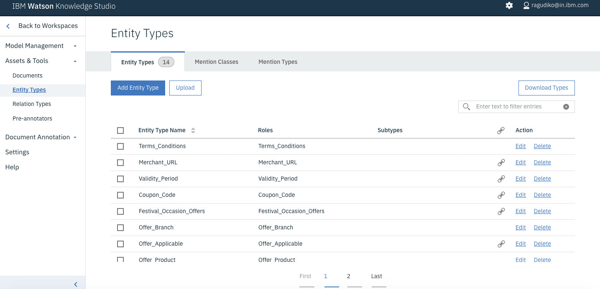
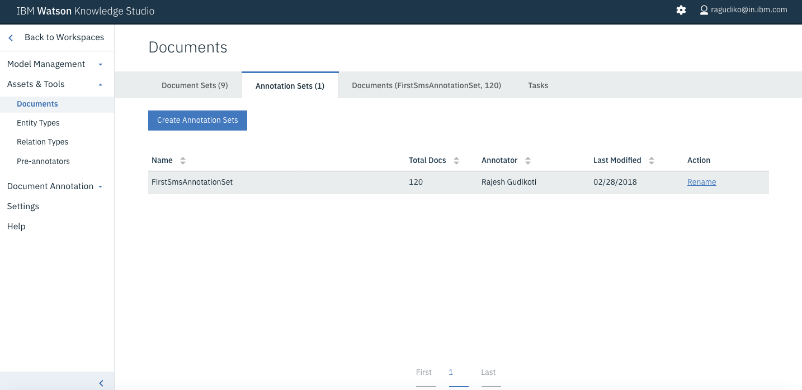
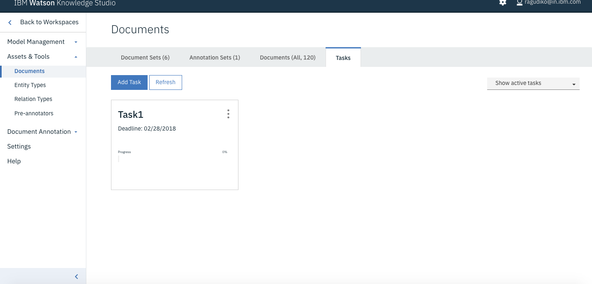
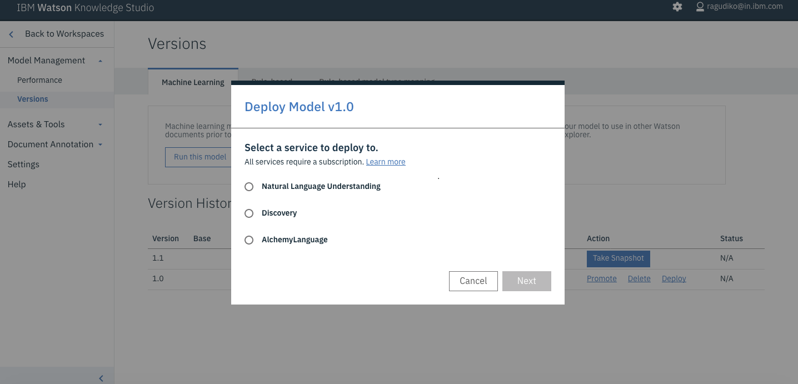

# Analyzing SMS messages with Watson Knowledge Studio


<!--

-->

This code pattern describes how to analyze SMS messages with Watson Knowledge Studio (WKS) and Watson's Natural Language Understanding (NLU) capability to extract entities in the data. Current natural language processing techniques cannot extract or interpret data that is domain or industry specific. The data (entities) represent different meaning in different domains. The best answer to such a problem is IBM's Watson Knowledge Studio. Consider a case where we need to extract entities present in a commercial SMS. For example:

```
PIZZA! Don't Cook Wednesdays are here! Get 50% off a Medium Pizza.
Offer available for single Pizza in-store and two for Home Delivery.
Walk-In/Call @ 555-555-5555
```

The example above has a few interesting entities which could not be extracted with conventional NLP techniques, but by using Watson services we can find out the following:

1. What is the offer?
2. Who is the merchant?
3. What is the offer name?
4. What is the offer's validity period?
5. What is the merchant's phone number?
6. What is the merchant's website?

After completing this code pattern, the user will learn how to:

* Upload a corpus with WKS
* Import types to WKS
* Use WKS to create a model
* Deploy a WKS model to NLU
* Call NLU APIs with a WKS model specified

## Flow


1. The user provides the client with an SMS message to be analyzed.
2. The client sends the SMS to Watson NLU for analysis, specifying which machine learning WKS model to use.
3. Watson NLU extracts the domain specific entities and returns the results to the client.
4. The client renders the results to the user.

## Technical Architecture


## Included components

* [Watson Natural Language Understanding](https://www.ibm.com/watson/developercloud/natural-language-understanding.html): An IBM Cloud service that can analyze text to extract meta-data from content such as concepts, entities, keywords, categories, sentiment, emotion, relations, semantic roles, using natural language understanding.
* [Watson Knowledge Studio](https://www.ibm.com/watson/services/knowledge-studio/): Teach Watson the language of your domain with custom models that identify entities and relationships unique to your industry, in unstructured text. Use the models in Watson Discovery, Watson Natural Language Understanding, and Watson Explorer.

## Featured Technologies

* [Artificial Intelligence](https://medium.com/ibm-data-science-experience): Artificial intelligence can be applied to disparate solution spaces to deliver disruptive technologies.

# Watch the Video

TBD!

# Steps

Use the ``Deploy to IBM Cloud`` button **OR** create the services and run locally.

## Deploy to IBM Cloud

[](https://bluemix.net/deploy?repository=https://github.com/IBM/sms-analysis-with-wks)

1. Press the above ``Deploy to IBM Cloud`` button and then click on ``Deploy``.

2. In Toolchains, click on Delivery Pipeline to watch while the app is deployed. Once deployed, the app can be viewed by clicking 'View app'.


3. To see the app and services created and configured for this journey, use the IBM Cloud dashboard. The app is named `sms-analysis-with-wks` with a unique suffix. The following service is created:
    * sms-nlu-service

## Run locally
> NOTE: These steps are only needed when running locally instead of using the ``Deploy to IBM Cloud`` button.

1. [Clone the repo](#1-clone-the-repo)
2. [Create IBM Cloud services](#2-create-ibm-cloud-services)
3. [Create a Watson Knowledge Studio workspace](#3-create-a-watson-knowledge-studio-workspace)
4. [Upload Type System](#4-upload-type-system)
5. [Import Corpus Documents](#5-import-corpus-documents)
6. [Create an Annotation Set](#6-create-an-annotation-set)
7. [Create a Task for Human Annotation](#7-create-a-task-for-human-annotation)
8. [Create the model](#8-create-the-model)
9. [Deploy the machine learning model to NLU](#9-deploy-the-machine-learning-model-to-nlu)
10. [Test the model with cURL](#10-test-the-model-with-curl)
11. [Run the application](#11-run-the-application)

### 1. Clone the repo

```
$ git clone https://github.com/IBM/sms-analysis-with-wks
```

### 2. Create IBM Cloud services

Create the following services:

* [**Watson Natural Language Understanding**](https://console.bluemix.net/catalog/services/natural-language-understanding)
* [**Watson Knowledge Studio**](https://console.bluemix.net/catalog/services/knowledge-studio)

### 3. Create a Watson Knowledge Studio workspace

Launch the **WKS** tool and create a new **workspace**.


### 4. Upload Type System

A type system allows us to define things that are specific to our SMS messages. The type system controls how content can be annotated by defining the types of entities that can be labeled and how relationships among different entities can be labeled.

To upload our pre-defined type system, from the **Access & Tools -> Entity Types** panel, press the **Upload** button to import the **Type System** file  [wks-resources/types-a6850330-3aeb-11e7-bf5c-f98dfa3ddf29.json](wks-resources/types-a6850330-3aeb-11e7-bf5c-f98dfa3ddf29.json) found in the local repository.


This will upload a set of **Entity Types** and **Relation Types**.




### 5. Import Corpus Documents

Corpus documents are required to train our machine-learning annotator component. For this Code Pattern, the corpus documents will contain example SMS messages.

> NOTE: To view the individual SMS messages in easy-to-read format, view the file [data/offers_msg.csv](data/offers_msg.csv) found in the local repository. 

From the **Access & Tools -> Documents** panel, press the **Upload Document Sets** button to import a **Document Set** file. Use the corpus documents file [wks-resources/corpus-a6850330-3aeb-11e7-bf5c-f98dfa3ddf29.zip](wks-resources/corpus-a6850330-3aeb-11e7-bf5c-f98dfa3ddf29.zip) found in the local repository.

> NOTE: Uploading the corpus documents provided in this Code Pattern is not required, but recommended to simplify the annotation process (all provided documents will come pre-annotated). An alternative approach would be to is to upload standard text files and perform the annotations manually. 

> NOTE: Select the option to "upload the original workspace's type system first".


### 6. Create an Annotation Set

Once the corpus documents are loaded, we can start the human annotation process. This begins by dividing the corpus into multiple document sets and assigning the document sets to human annotators (for this Code Pattern, we will just be using using one document set and one annotator).

From the **Access & Tools -> Documents** panel, press the **Create Annotation Sets** button. Select a valid **Annotator** user, and provide a unique name for **Set name**.




### 7. Create a Task for Human Annotation

Add a task for human annotation by creating a task and assigning it annotation sets.

From the **Access & Tools -> Documents** panel, select the **Task** tab and press the **Add Task** button.


Enter a unique **Task name** and press the **Create** button.

A panel will then be displayed of the available annotation sets that can be assigned to this task. Select the **Annotation Set** you created in the previous step, and press the **Create Task** button.




#### 7.1 Start the Human Annotation task

Click on the task card to view the task details panel.


Click the **Annotate** button to start the **Human Annotation** task.


If you select any of the documents in the list, the **Document Annotation** panel will be displayed. Since we previously imported the corpus documents, the entity and relationship annotations are already completed (as shown in the following examples). You can annotate mentions (occurrences of words/phrases which can be annotated as an entity) to play around, or you can modify one by annotating mentions with a different entity.


#### 7.2 Submit Annotation Set

From the **Task** details panel, press the **Submit All Documents** button.


All documents should change status to **Completed**.


Press the blue "File" icon to toggle back to the **Task** panel, which will show the completion percentage for each task.


From the **Access & Tools -> Documents** panel, select the **Task** tab and select the task to view the details panel.


Select your **Annotation Set Name** and then press the **Accept** button. This step is required to ensure that the annotation set is considered **ground truth**.

> NOTE: The objective of the annotation project is to obtain ground truth, the collection of vetted data that is used to adapt WKS to a particular domain.


**Status** should now be set to **COMPLETED**.


### 8. Create the model

Go to the **Model Management -> Performance** panel, and press the **Train and evaluate** button.


From the **Document Set** name list, select the **Annotation Set Name** you created previously and press the **Train** button.


This process may take several minutes to complete. Progress will be shown in the upper right corner of the panel.


Once complete, return to the **Model Management -> Performance** panel and select the **Train and evaluate** button again.

From this panel, select the **Edit Settings** button to view the **Document Set** list again.

This time, select the document sets for msg_1, msg_2 and msg_3, and then press the **Evaluate** button. This process may take several minutes to complete.

> Note: For this simplified Code Pattern, we **evaluate** using only 3 messages as a short-cut to generate a reasonable precision/recall value (around .60), which should result in decent model performance. In practice, you would create separate annotation sets (each containing thousands of messages) for training and evaluation.


Once complete, you will see the results of the test and evaluate process.


You can view the log files of the process by clicking the **View Log** button.


### 9. Deploy the machine learning model to NLU

Now we can deploy our new model to the already created **NLU** service. Navigate to the **Version** menu on the left and press **Take Snapshot**.


The snapshot version will now be available for deployment to NLU.


To start the process, click the **Deploy** button associated with your snapshot version.

Select the option to deploy to **Natural Language Understanding**.



Then enter your IBM Cloud account information to locate your **NLU** service to deploy to.


Once deployed, a **Model ID** will be created. Keep note of this value as it will be required later in this Code Pattern. 


> NOTE: You can also view this **Model ID** by pressing the **NLU** botton listed with your snapshot version.

### 10. Test the model with cURL

Using cURL is the quickest way to show the advantages of WKS. Let's see the result of using NLU with and without a WKS model.

#### NLU with a WKS model

In the following examples, replace `username` and `password` with your own **NLU** credentials. In this first example, we will also be adding an `entites.model` argument to the query string. Replace this value with your own **WKS** model ID. 

The SMS text is URL encoded as it is passed as a query argument. Note that the model used to train and evaluate entities is based on a few sample SMS offers, which can be viewed in the [data/offers_msg.csv](data/offers_msg.csv) file.

After issuing this cURL command, it is clear in the server response that we can see domain specific entities like `Offer`, `Offer_Period`, and `Merchant`.

```
curl -u "$username":"$password" \
"https://gateway.watsonplatform.net/natural-language-understanding/api/v1/analyze?version=2017-02-27&text=DUNKI%20DONUTS%20is%20now%20open%20at%20Girgaum%20Chowpatty.%20Walk-in%20and%20enjoy%20the%20Valentaine%20SPL%20offer%20on%20your%20favorite%20Donuts.%20Buy%203%20%26%20Get%203%20FREE.%20Valid%20till%2015%20Feb%202017.%20T%26C&features=entities&entities.model=10:047ef383-83e6-4e90-913b-af04b731859d"

{
    "language": "en",
    "entities": [{
        "type": "Merchant",
        "text": "DUNKI DONUTS",
        "count": 1
    }, {
        "type": "Location",
        "text": "Girgaum",
        "count": 1
    }, {
        "type": "Offer",
        "text": "Get 3 FREE",
        "count": 1
    }, {
        "type": "Offer_Period",
        "text": "Valid till 15 Feb 2017",
        "count": 1
    }, {
        "type": "Term_and_Conditions",
        "text": "T&C",
        "count": 1
    }]
}
```

#### NLU without a WKS model

Using **NLU** without a **WKS** model ID is less ideal, as the server does not extract the entities we are looking for. It extracts generic data such as company name and some location details, but it does not extract the domain specific offer details we desire.

```
curl -u "$username":"$password" \
"https://gateway.watsonplatform.net/natural-language-understanding/api/v1/analyze?version=2017-02-27&text=DUNKI%20DONUTS%20is%20now%20open%20at%20Girgaum%20Chowpatty.%20Walk-in%20and%20enjoy%20the%20Valentaine%20SPL%20offer%20on%20your%20favorite%20Donuts.%20Buy%203%20%26%20Get%203%20FREE.%20Valid%20till%2015%20Feb%202017.%20T%26C&features=entities"

{
    "language": "en",
    "entities": [{
        "type": "Company",
        "text": "DUNKI DONUTS",
        "relevance": 0.976076,
        "count": 1
    }, {
        "type": "GeographicFeature",
        "text": "Girgaum Chowpatty",
        "relevance": 0.65276,
        "count": 1
    }]
}
```

### 11. Run the application

## Java Client

You can run the simple java client provided in this project to extract the entities from SMS messages.

## Testing

JUnit tests are run using [maven](https://maven.apache.org/download.cgi). To configure maven, open `.bash_profile` if it exists (create a new `.bash_profile` otherwise), and add the entry below:

```
JAVA_HOME=/Library/Java/JavaVirtualMachines/jdk1.7.0_40.jdk/Contents/Home
export JAVA_HOME
M2_HOME=/usr/local/apache-maven/apache-maven-3.1.1
export M2_HOME
PATH=$PATH:$JAVA_HOME/bin:$M2_HOME/bin
export PATH
```

If Apache Maven is being used, the following dependency should be included:

```xml
<dependency>
    <groupId>com.ibm.watson.developer_cloud</groupId>
    <artifactId>java-sdk</artifactId>
    <version>1.0</version>
</dependency>
<dependency>
    <groupId>com.ibm.watson.developer_cloud</groupId>
    <artifactId>java-sdk</artifactId>
    <version>1.0</version>
</dependency>
```

From a terminal run the command below from the root directory of the repository:

```
mvn test
```

# Sample UI layout


# Troubleshooting

# Learn more

* **Artificial Intelligence Code Patterns**: Enjoyed this Code Pattern? Check out our other [AI Code Patterns](https://developer.ibm.com/code/technologies/artificial-intelligence/).
* **AI and Data Code Pattern Playlist**: Bookmark our [playlist](https://www.youtube.com/playlist?list=PLzUbsvIyrNfknNewObx5N7uGZ5FKH0Fde) with all of our Code Pattern videos
* **With Watson**: Want to take your Watson app to the next level? Looking to utilize Watson Brand assets? [Join the With Watson program](https://www.ibm.com/watson/with-watson/) to leverage exclusive brand, marketing, and tech resources to amplify and accelerate your Watson embedded commercial solution.
* [Procurement Analysis with WKS](https://github.com/IBM/procurement-analysis-with-wks): Another code pattern that is focused on a procurement use case where WKS is used with Discovery and IBM Graph.

# License

[Apache 2.0](LICENSE)
