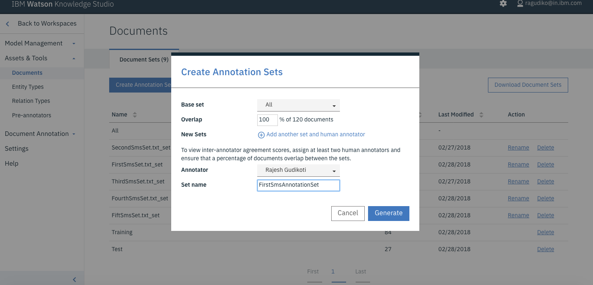

# Analyzing SMS messages with Watson Knowledge Studio


<!--

-->

This code pattern describes how to analyze SMS messages with Watson Knowledge Studio and Waton's Natural Language Understanding capability to extract entities in the data.

**Background**: Current natural language processing techniques cannot extract or interpret data that is domain or industry specific. The data (entities) represent different meaning in different domains. The best answer to such a problem is IBM's Watson Knowledge Studio.

Consider a case where we need to extract entities present in a commercial SMS. For example:

```
PIZZA! Don't Cook Wednesdays are here! Get 50% off a Medium Pizza. Offer available for single Pizza in-store and two for Home Delivery. Walk-In/Call @ 555-555-5555
```

The example above has a few interesting entities to be extracted, such as:

1. What is the offer?
2. Who is the merchant?
3. What is the offer name?
4. What is the offer's validity period?
5. What is the merchant's phone number?
6. What is the merchant's website?

Using cognitive SMS analysis, we can extract the above information from most SMS messages.

## Flow


1. The user provides an SMS message to be analyzed to a client.
2. The client sends the SMS to analzyed to Watson NLU, specifying which machine learning model to use in WKS.
3. Watson NLU extracts the domain specific entities and returns these results to the client.
4. The client renders the results to the user.

## Technical Architecture


## Included components

* [Watson Natural Language Understanding](https://www.ibm.com/watson/developercloud/natural-language-understanding.html): An IBM Cloud service that can analyze text to extract meta-data from content such as concepts, entities, keywords, categories, sentiment, emotion, relations, semantic roles, using natural language understanding.
* [Watson Knowledge Studio](https://www.ibm.com/watson/services/knowledge-studio/): Teach Watson the language of your domain with custom models that identify entities and relationships unique to your industry, in unstructured text. Use the models in Watson Discovery, Watson Natural Language Understanding, and Watson Explorer.

## Featured Technologies

* [Artificial Intelligence](https://medium.com/ibm-data-science-experience): Artificial intelligence can be applied to disparate solution spaces to deliver disruptive technologies.

# Watch the Video

TBD!

# Steps

1. [Create an NLU service](#1-create-an-nlu-service)
2. [Create a WKS service](#2-create-a-wks-service)
3. [Create a WKS workspace](#3-create-a-wks-workspace)
4. [Upload Type System](#4-upload-type-system)
5. [Import Corpus Documents](#5-import-corpus-documents)
6. [Create an Annotation Set](#6-create-an-annotation-set)
7. [Create a Task for Human Annotation](#7-create-a-task-for-human-annotation)
8. [Create the model](#8-create-the-model)
9. [Deploy the machine learning model to NLU](#9-deploy-the-machine-learning-model-to-nlu)

## 1. Create an NLU service

* Create an NLU service by going to the [NLU service](https://console.bluemix.net/catalog/services/natural-language-understanding) page.


## 2. Create a WKS service

* Create a WKS service by going to the [WKS service](https://console.bluemix.net/catalog/services/knowledge-studio) page.


## 3. Create a WKS workspace

* Create a new empty workspace where our model will be created.


## 4. Upload Type System

* Use the file located at: [wks-resources/types-a6850330-3aeb-11e7-bf5c-f98dfa3ddf29.json](wks-resources/types-a6850330-3aeb-11e7-bf5c-f98dfa3ddf29.json)


## 5. Import Corpus Documents

* Use the file located at[wks-resources/corpus-a6850330-3aeb-11e7-bf5c-f98dfa3ddf29.zip](wks-resources/corpus-a6850330-3aeb-11e7-bf5c-f98dfa3ddf29.zip)

> It is not necessary to use the corpus documents, however for beginners we recommend to use the corpus documents provided.


## 6. Create an Annotation Set




## 7. Create a Task for Human Annotation


### 7.1 Select Annotation Set for this task


Start the Human Annotation by clicking the `Annotate` button.  Since we previously imported the corpus documents already have the annotations completed. You can look at entities and relationships already annotated. You can annotate mentions (occurrences of words/phrases which can be annotated as entity) to play around or you can modify by annotating mention with different entity.


## 7.2 Submit Annotation Set


## 8. Create the model


## 9. Deploy the machine learning model to NLU

* Finally deploy our new model to the already created NLU service.


# Usage

## Java Client
You can run the simple java client provided in this project to extract the entities from SMS messages.

## cURL
Alternatively you can use the curl commands.

### NLU without WKS model

```
curl -u "username":"password" "https://gateway.watsonplatform.net/natural-language-understanding/api/v1/analyze?version=2017-02-27&text=DUNKI%20DONUTS%20is%20now%20open%20at%20Girgaum%20Chowpatty.%20Walk-in%20and%20enjoy%20the%20Valentaine%20SPL%20offer%20on%20your%20favorite%20Donuts.%20Buy%203%20%26%20Get%203%20FREE.%20Valid%20till%2015%20Feb%202017.%20T%26C&features=entities"

Output:{ "language": "en", "entities": [ { "type": "Company", "text": "DUNKI DONUTS", "relevance": 0.976076, "count": 1 }, { "type": "GeographicFeature", "text": "Girgaum Chowpatty", "relevance": 0.65276, "count": 1 } ] }
```

The API is able to capture company (merchant) and location which are generic entities. It fails to extract the offer details as per our expectation.

### NLU with WKS model

```
curl -u "username":"password" "https://gateway.watsonplatform.net/natural-language-understanding/api/v1/analyze?version=2017-02-27&text=DUNKI%20DONUTS%20is%20now%20open%20at%20Girgaum%20Chowpatty.%20Walk-in%20and%20enjoy%20the%20Valentaine%20SPL%20offer%20on%20your%20favorite%20Donuts.%20Buy%203%20%26%20Get%203%20FREE.%20Valid%20till%2015%20Feb%202017.%20T%26C&features=entities&entities.model=10:a5172791-b31b-4b0d-b546-3610ec652ca4"

Output:{ "language": "en", "entities": [ { "type": "Merchant", "text": "DUNKI DONUTS", "count": 1 }, { "type": "Location", "text": "Girgaum", "count": 1 }, { **"type": "Offer", "text": "Get 3 FREE", "count": 1 }, { "type": "Offer_Period", "text": "Valid till 15 Feb 2017", "count": 1 }, { "type": "Term_and_Conditions", "text": "T&C",** "count": 1 } ] }
```

### Differences

If we look the entities extracted in the form of JSON, we get domain specific entities like `offer`, `offer period`, `merchant`. The model I used is trained and evaluated based on few sample sms. The sample sms are available under data folder.

Once the WKS model is built and the NLU service you can replace username/password highlighted with your NLU service credentials. Replace WKS model id (entities.model) with your WKS model id. The SMS text has to be URL encoded as it is passed as URL query string in curl command.

## Run JUnits using maven command

* Download Maven : https://maven.apache.org/download.cgi

* Install Maven: https://maven.apache.org/install.html

Configure maven: Open `.bash_profile` if exists, else create new `.bash_profile` file. Make below entries into .bash_profile file.

```
JAVA_HOME=/Library/Java/JavaVirtualMachines/jdk1.7.0_40.jdk/Contents/Home

export JAVA_HOME

M2_HOME=/usr/local/apache-maven/apache-maven-3.1.1

export M2_HOME

PATH=$PATH:$JAVA_HOME/bin:$M2_HOME/bin

export PATH
```

If Apache Maven is being used, the following dependency should be included:

```xml
<dependency>
    <groupId>com.ibm.watson.developer_cloud</groupId>
    <artifactId>java-sdk</artifactId>
    <version>1.0</version>
</dependency>
<dependency>
    <groupId>com.ibm.watson.developer_cloud</groupId>
    <artifactId>java-sdk</artifactId>
    <version>1.0</version>
</dependency>
```

Now from terminal run below command

```
mvn test
```

# Deploy the App

[](https://bluemix.net/deploy?repository=https://github.com/IBM/sms-analysis-with-wks)

# Learn more

* **Artificial Intelligence Code Patterns**: Enjoyed this Code Pattern? Check out our other [AI Code Patterns](https://developer.ibm.com/code/technologies/artificial-intelligence/).
* **AI and Data Code Pattern Playlist**: Bookmark our [playlist](https://www.youtube.com/playlist?list=PLzUbsvIyrNfknNewObx5N7uGZ5FKH0Fde) with all of our Code Pattern videos
* **With Watson**: Want to take your Watson app to the next level? Looking to utilize Watson Brand assets? [Join the With Watson program](https://www.ibm.com/watson/with-watson/) to leverage exclusive brand, marketing, and tech resources to amplify and accelerate your Watson embedded commercial solution.
* [Procurement Analysis with WKS](https://github.com/IBM/procurement-analysis-with-wks): Another code pattern that is focused on a procurement use case where WKS is used with Discovery and IBM Graph.

# License

[Apache 2.0](LICENSE)
