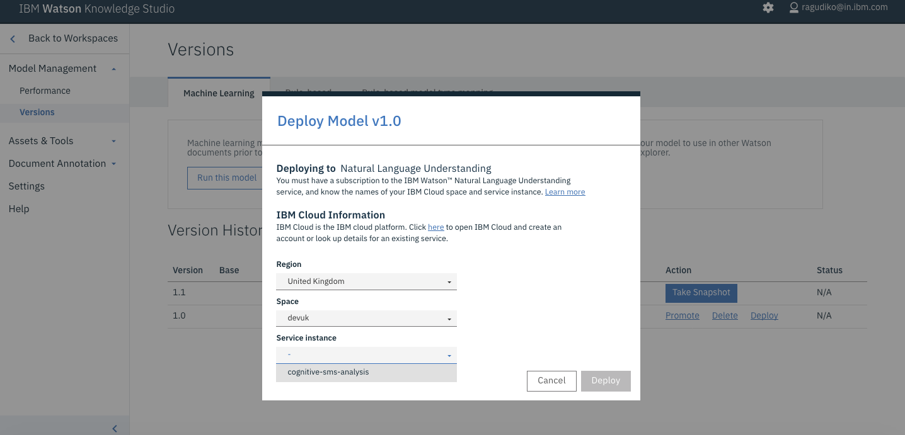

# Analyzing SMS messages with Watson Knowledge Studio


<!--

-->

This is cognitive SMS client which uses natural language understanding capability to analyze the SMS and extracts entity data required.

Background: Current natural language processing techniques cannot extract/interpret the data as required by domain/industry specific. The data(entities) represent different meaning in different domain. Best answer to such problem is IBM Watson Knowledge Studio. Consider an example where we need to extract entities present in commercial SMS.

In such commercial SMS usually interesting entities to be extracted are:
1. what is the offer
2. who is providing(merchant)
3. offer name(if present in SMS)
4. offer validity period

We can also additional info like merchant name, merchant location, merchant website, merchant phone number in case this info is available in SMS.

The above requirement can be achieved by using our cognitive SMS analysis.

## Maven

If Apache Maven is being used, the following dependency should be included:

```xml
<dependency>
    <groupId>com.ibm.watson.developer_cloud</groupId>
    <artifactId>java-sdk</artifactId>
  	<version>1.0</version>
</dependency> 	
<dependency>
    <groupId>com.ibm.watson.developer_cloud</groupId>
    <artifactId>java-sdk</artifactId>
    <version>1.0</version>
</dependency>
```

## Process Flow


## Technical Architecture


## Features
1. User can feed sms to NLU which has machine learning model deployed in it.
2. The NLU analyzes the sms and extracts the domain specific entities.
3. The extracted entities will provide info like what is the offer, who is providing offer and offer valid date etc.

# Steps

## 1. Create a NLU service


## 2. Create a WKS service


## 3. Create a WKS workspace


## 4. Upload Type System

Use the file located at: [wks-resources/types-a6850330-3aeb-11e7-bf5c-f98dfa3ddf29.json](wks-resources/types-a6850330-3aeb-11e7-bf5c-f98dfa3ddf29.json)


## 5. Import Corpus Documents

Use the file located at[wks-resources/corpus-a6850330-3aeb-11e7-bf5c-f98dfa3ddf29.zip](wks-resources/corpus-a6850330-3aeb-11e7-bf5c-f98dfa3ddf29.zip)

> It is not necessary to use the corpus documents, however for beginners we recommend to use the corpus documents provided.


## 6. Create an Annotation Set


## 7. Create a Task for Human Annotation


### 7.1 Select Annotation Set for this task


Start the Human Annotation by clicking the `Annotate` button.  Since we previously imported the corpus documents already have the annotations completed. You can look at entities and relationships already annotated. You can annotate mentions (occurrences of words/phrases which can be annotated as entity) to play around or you can modify by annotating mention with different entity.


## 8. Submit Annotation Set


## 9. Create model, train and evaluate


## 10. Deploy the machine learning model to NLU




# Usage

## Java Client
You can run the simple java client provided in this project to extract the entities from SMS messages.

## cURL
Alternatively you can use the curl commands.

### NLU without WKS model

```
curl -u "username":"password" "https://gateway.watsonplatform.net/natural-language-understanding/api/v1/analyze?version=2017-02-27&text=DUNKI%20DONUTS%20is%20now%20open%20at%20Girgaum%20Chowpatty.%20Walk-in%20and%20enjoy%20the%20Valentaine%20SPL%20offer%20on%20your%20favorite%20Donuts.%20Buy%203%20%26%20Get%203%20FREE.%20Valid%20till%2015%20Feb%202017.%20T%26C&features=entities"

Output:{ "language": "en", "entities": [ { "type": "Company", "text": "DUNKI DONUTS", "relevance": 0.976076, "count": 1 }, { "type": "GeographicFeature", "text": "Girgaum Chowpatty", "relevance": 0.65276, "count": 1 } ] }
The api is able to capture company(merchant) and location which are generic entities. It fails to extract the offer details as per our expectation.
```

### NLU with WKS model

```
curl -u "username":"password" "https://gateway.watsonplatform.net/natural-language-understanding/api/v1/analyze?version=2017-02-27&text=DUNKI%20DONUTS%20is%20now%20open%20at%20Girgaum%20Chowpatty.%20Walk-in%20and%20enjoy%20the%20Valentaine%20SPL%20offer%20on%20your%20favorite%20Donuts.%20Buy%203%20%26%20Get%203%20FREE.%20Valid%20till%2015%20Feb%202017.%20T%26C&features=entities&entities.model=10:a5172791-b31b-4b0d-b546-3610ec652ca4"


Output:{ "language": "en", "entities": [ { "type": "Merchant", "text": "DUNKI DONUTS", "count": 1 }, { "type": "Location", "text": "Girgaum", "count": 1 }, { **"type": "Offer", "text": "Get 3 FREE", "count": 1 }, { "type": "Offer_Period", "text": "Valid till 15 Feb 2017", "count": 1 }, { "type": "Term_and_Conditions", "text": "T&C",** "count": 1 } ] }
```

### Differences

If we look the entities extracted in the form of JSON, we get domain specific entities like `offer`, `offer period`, `merchant`. The model I used is trained and evaluated based on few sample sms. The sample sms are available under data folder.

Once the WKS model is built and the NLU service you can replace username/password highlighted with your NLU service credentials. Replace WKS model id (entities.model) with your WKS model id. The SMS text has to be URL encoded as it is passed as URL query string in curl command.

## Run JUnits using maven command

* Download Maven : https://maven.apache.org/download.cgi

* Install Maven: https://maven.apache.org/install.html

Configure maven: Open .bash_profile if exists, else create new .bash_profile file. Make below entries into .bash_profile file.

```
JAVA_HOME=/Library/Java/JavaVirtualMachines/jdk1.7.0_40.jdk/Contents/Home

export JAVA_HOME

M2_HOME=/usr/local/apache-maven/apache-maven-3.1.1

export M2_HOME

PATH=$PATH:$JAVA_HOME/bin:$M2_HOME/bin

export PATH
```

Now from terminal run below command

```
mvn test
```

# Additional Resources

* You can register at https://console.bluemix.net to access NLU.

* You can try free version of WKS by logging into https://console.bluemix.net and select knowledge studio service under Watson

* You can refer https://github.com/IBM/procurement-analysis-with-wks for procurement use case where we have used WKS, Discovery and IBM Graph.

# Deploy the App

[](https://bluemix.net/deploy?repository=https://github.com/IBM/sms-analysis-with-wks)