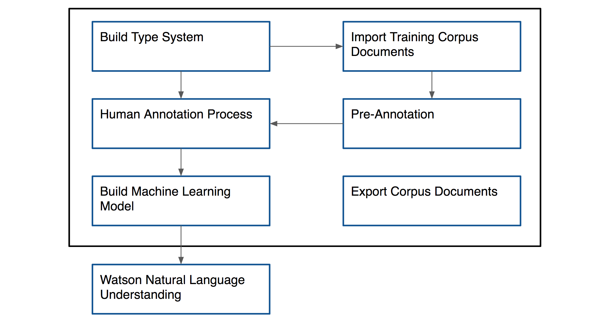
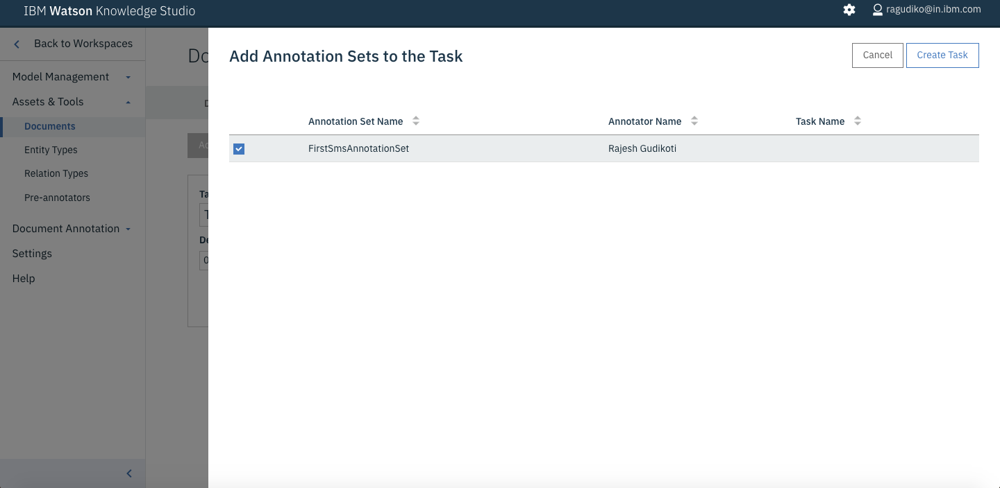
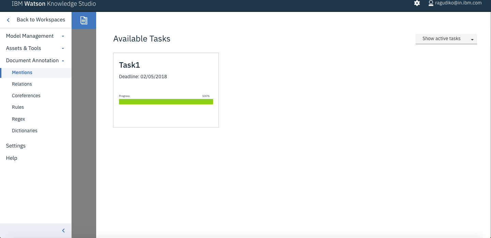

@@ -19,20 +19,20 @@ The above requirement can be achieved by using our cognitive sms analysis.
## Maven
If Apache Maven is being used, the following dependency should be included:
```xml
  	<dependency>
  		<groupId>com.ibm.watson.developer_cloud</groupId>
  		<artifactId>java-sdk</artifactId>
  		<version>1.0</version>
  	</dependency> 	
<dependency>
    <groupId>com.ibm.watson.developer_cloud</groupId>
    <artifactId>java-sdk</artifactId>
    <version>1.0</version>
</dependency>
```

## Process Flow




## Technical Architecture


## Features
@@ -41,95 +41,94 @@ If Apache Maven is being used, the following dependency should be included:
3. The extracted entities will provide info like what is the offer, who is providing offer and offer valid date etc.

## Create NLU service


## Create WKS model and deploy the model to nlu
1. Create wks service instance


2. Create workspace


3. Import Type System navigating to wks-resources/types-a6850330-3aeb-11e7-bf5c-f98dfa3ddf29.json


4. Import Corpus Documents navigating to wks-resources/corpus-a6850330-3aeb-11e7-bf5c-f98dfa3ddf29.zip


5. Create Annotation Set


6. Create Task for Human Annotation


### Select Annotation Set for this task





### Start Human Annotation clicking Annotate button


7. Submit Annotation Set for which human annotation is complete





8. Create model, train and evaluate


9. Deploy the Machine Learning model to NLU


